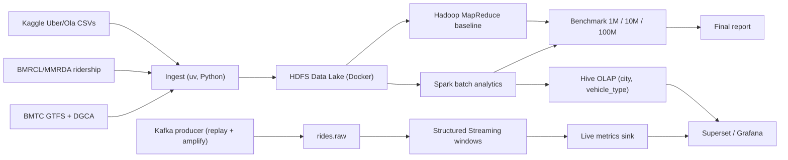

# Architecture

FlowState is a Lambda pipeline on Indian urban mobility data. CityPulse (EU FP7, 2014–2017) is the **reference architecture**, not a code donor — their stack is Java/AMQP/RDF; ours is Kafka / Spark / HDFS / Hive.

## CityPulse → FlowState

| CityPulse | FlowState |
|---|---|
| Data bus (AMQP) | Kafka topics `rides.raw`, `rides.enriched` |
| Aggregated / annotated streams | Spark Structured Streaming rolling windows |
| Event detection nodes | One streaming job per metric (surge, active rides, cancellations) |
| GDI / historical store | HDFS lake + Hive, partitioned by city / vehicle type |
| Resource manager | YARN (in the Hadoop images; spike) |
| City Dashboard | Superset over Hive (batch) + streaming sink (live) |
| KAT analytics | Spark batch diagnostics |

Cite CityPulse in the report as: *"Real-Time Stream Processing **and** Large-scale Data Analytics"* — batch layer = large-scale analytics, speed layer = real-time stream.

Do **not** plan to run CityPulse repos. Full mapping and repo ranking: [agents/citypulse.md](agents/citypulse.md).

## Runtime

Spark, HDFS, YARN, Hive, Kafka, Superset: Docker Compose only. Host `uv` is for ingest, the Kafka producer, tests, and lint. Details: [dev-modes.md](dev-modes.md).

## Open infra (deliberate)

Two items are **not** finished in this scaffold on purpose — they are the riskiest learning spikes:

1. Hive warehouse dir on HDFS (`hive.metastore.warehouse.dir` → `hdfs://namenode:9000/...`).
2. MapReduce job actually completing on YARN in the bde2020 images.

See [team.md](team.md) spikes and [agents/spikes.md](agents/spikes.md).
