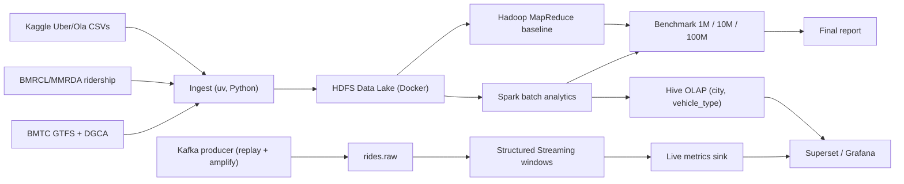

# Architecture

FlowState is a Lambda pipeline on Indian urban mobility data. CityPulse (EU FP7, 2014–2017) is the reference architecture, not a code donor. Decisions: [ADR-0001](adr/0001-citypulse-reference-architecture-only.md), [ADR-0002](adr/0002-lambda-pipeline-kafka-spark-hdfs-hive.md).

CityPulse → FlowState component map (Kafka topics, windows, Hive partitions, dashboards): **[ADR-0002](adr/0002-lambda-pipeline-kafka-spark-hdfs-hive.md)**. Repo ranking and reading list: [agents/citypulse.md](agents/citypulse.md).

## Runtime

Compose cluster + host uv: [ADR-0003](adr/0003-compose-cluster-host-uv.md). Operator detail: [dev-modes.md](dev-modes.md).

## Open infra (deliberate)

Two items are unfinished in this scaffold on purpose — riskiest learning spikes:

1. Hive warehouse dir on HDFS (`hive.metastore.warehouse.dir` → `hdfs://namenode:9000/...`).
2. MapReduce job completing on YARN in the bde2020 images.

See [team.md](team.md) and [agents/spikes.md](agents/spikes.md).
