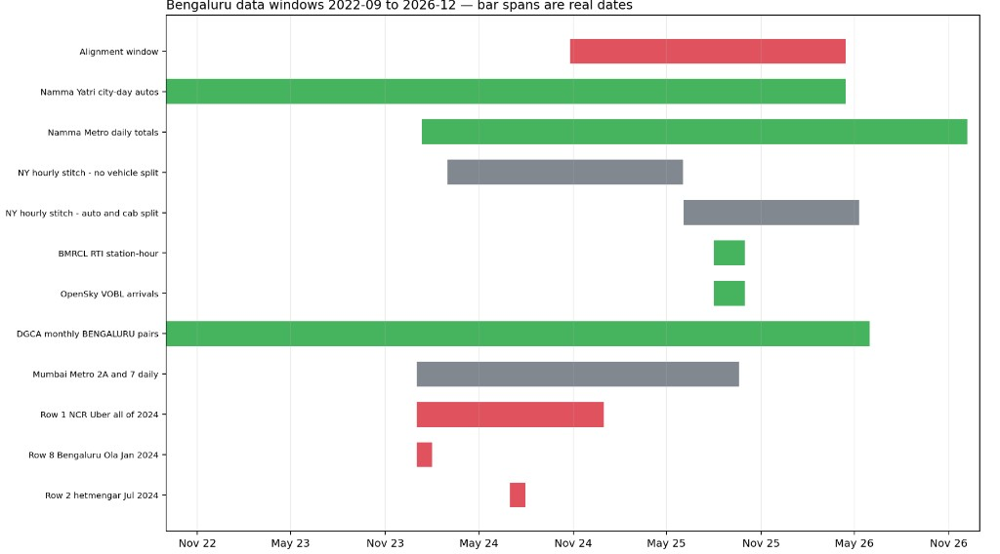
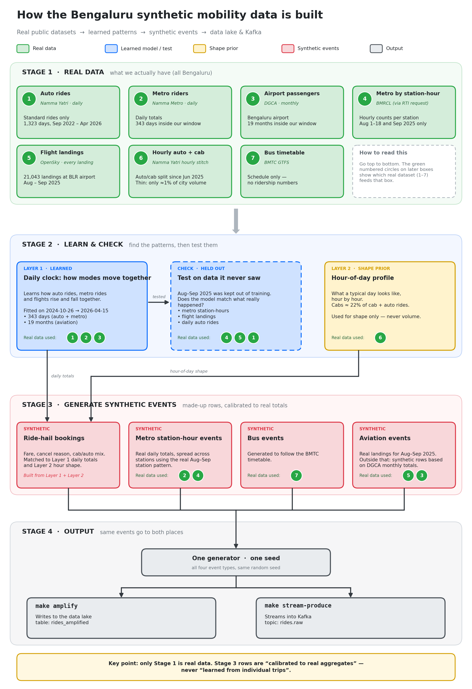

# Data sources and acquisition (Bengaluru pipeline)

Permanent reference for where FlowState's data comes from, what was verified, and how each source is used. Written from the exploration runs of 2026-10-09/10. The resampler design that hangs off these sources is ADR-0010 (option D, see below).

Rows 1–8 of the locked source table (ticket #3) still govern ingest until that ticket is amended. Rows 1, 2, and 8 failed the synthetic test and should come out of that table. Q5 already drops rows 2 and 8 as demand evidence. Q4 (drop the NCR slice, row 1) is still open, so the amendment waits until the questionnaire is finished. New sources below (Namma Yatri, BMRCL RTI, OpenSky) are proposed additions in the same amendment. The questionnaire is still open locally and is not in this commit. Ticket text is not edited until those answers are in.

`make ingest` is the acquisition entrypoint (`python -m flowstate.ingest`). `DATASET=all` runs ridehail, metro, bus, events, then aviation, and rewrites `flowstate-datasets/provenance/manifest.json` afterwards. One modality: `DATASET=ridehail`, `metro`, `bus`, `aviation`, or `events`. `DATASET=manifest` only rehashes disk. `DATASET=validate` fails if a hash drifted or a dataset is not valid. Downstream code calls `flowstate.provenance.require_valid()` before reading those files.

OpenSky runs inside `DATASET=aviation`. Credentials come from `Settings.opensky_clients()`: `FLOWSTATE_OPENSKY_CLIENT_ID` and `FLOWSTATE_OPENSKY_CLIENT_SECRET`, plus `_2` through `_4`. The fetch is the alignment window, about 8,100 flight credits if nothing is cached. When every configured client is under 30 credits, ingest stops, writes the partial extract, marks `opensky_vobl_arrivals` not valid, and exits non-zero. It does not wait for the daily refill. Mumbai is out of scope. License text is not in the manifest.

## How to read this doc: grain notation

"`A × B`" describes what one row of a file represents. One row per `A` per `B`.

| Notation              | One row is                                              | Example                                          |
| --------------------- | ------------------------------------------------------- | ------------------------------------------------ |
| city × day            | one city, one calendar day                              | "Bengaluru did 141,282 auto rides on 2025-08-01" |
| ward × hour           | one municipal ward, one clock hour                      | ride-hail activity inside ward 112, 18:00–19:00  |
| station × hour        | one metro station, one clock hour                       | "Trinity had 50 entries from 06:00 to 07:00"     |
| station-pair × hour   | one origin station to one destination station, one hour | "Baiyappanahalli → MG Road, 08:00–09:00"         |
| city × hour × vehicle | one city, one hour, one vehicle class                   | "BLR autos 20:00–21:00"                          |
| event grain           | one trip / one landing / one booking                    | one OpenSky arrival row                          |

Rule of thumb for couplings: a cross-modal question can only be answered at the **coarsest grain among its legs**. If ride-hail is daily and aviation landings are per-event, the pairing answers day-grain questions, not hour-grain ones.

## Naming traps

"Namma" means "our" in Kannada. Two unrelated systems use it.

- **Namma Yatri** is a private auto-rickshaw hailing app, run by JusPay. It publishes the open data used here for the `ride_hail` mode (`vehicle_type=auto`).
- **Namma Metro** is the city metro, run by BMRCL. Its ridership tracker is the `metro` mode.

One more: Namma Metro names its corridors after colors (east–west **Purple Line**, north–south **Green Line**). This collides with Namma Yatri's "Purple" booking type (disability-accessible rides). In this doc, "Purple" always means the ride-hail booking type, never the metro line.

## The overlap picture

Reading notes:

- The red band is the **alignment window**, 2024-10-26 → 2026-04-15. The end date is where the ride-hail city-day clock stops. Pinning the end is questionnaire Q11 (open).
- The DGCA bar is drawn from 2022-09 to fit the axis. The file actually starts 2015-04.
- The Namma Metro bar shows its span. The file has 438 rows over 726 possible days; inside the alignment window 343 of 537 days exist. Gaps are scraper misses, not closed stations.
- The RTI bar covers Aug–Sep 2025, but the August part stops at the 18th.
- Red rows 1/2/8 are generated files (see "Rejected as synthetic").

### What overlaps, at what grain, and why

All rows are real data on a shared clock.

| Coupling                                           | Grain | Window                  | Size            | Why this grain                                   |
| -------------------------------------------------- | ----- | ----------------------- | --------------- | ------------------------------------------------ |
| auto ↔ metro                                       | day   | 2024-10-26 → 2026-04-15 | 343 shared days | both legs publish daily totals                   |
| auto ↔ metro ↔ aviation (DGCA)                     | month | 2024-10 → 2026-04       | 19 months       | DGCA is monthly, so the three-way is monthly     |
| metro (station × hour) ↔ aviation (landing events) | hour  | 2025-08-01 → 2025-09-30 | 61 days         | RTI and OpenSky are both finer than daily here   |
| auto ↔ aviation (landing events)                   | day   | 2025-08-01 → 2025-09-30 | 61 days         | OpenSky is event grain, but city autos are daily |

The 343 days: the alignment window has 537 calendar days; Namma Yatri covers 537/537, the metro tracker has rows on 343 of them, so the intersection is 343.

**Hour-grain honesty note.** The flagship question "aircraft land → more ground-transport demand" needs hour grain to be meaningful. At day grain it collapses to "days with more landings had more rides", which is confounded by everything else that day. Inside Aug–Sep 2025 the hour-grain test is real and strong for **metro** (RTI station-hours vs landing banks). For **auto/cab** the only hour-grain ride-hail data is the thin stitched slice (~1% of volume, see Layer 2), so the hour-grain landing → ride-hail response is supported by weak data. Day-grain "landings → city auto demand" is solid. Frame report claims accordingly.

## The working design (option D, chosen 2026-10-09)

Color code: green = real data, blue = learned model and validation, yellow = shape prior, pink/red = synthetic events. Only Stage 1 is real data. Layer 3 rows are reported as "calibrated to real aggregates", never "learned from trips".

### Layer 1 — learned clock (day grain)

The model learns how Bengaluru's auto rides, metro rides, and aviation passengers move together, one day at a time, 2024-10-26 → 2026-04-15. Inputs: Namma Yatri city-day autos (`booking_type=Normal` only), Namma Metro daily totals, DGCA monthly aviation rolled to months.

### Layer 2 — shape prior (hour grain)

The stitched hourly series tells us two things only: what a Bengaluru day looks like hour by hour, and that cabs are about 22 percent of cab-plus-auto rides. It cannot tell us city volume — its totals are about 1 percent of the city-day series and do not track it (correlation near zero). Use for shape, never for scale.

### Layer 3 — event unfold (synthetic, calibrated)

The lake and Kafka need rows, not daily totals. Layer 3 draws booking-grain rows so daily totals, cancellation rates, and average fare match Layer 1, and the hour profile and cab share match Layer 2. Metro events unfold real daily totals to station-hours using the real Aug–Sep station shape. Bus events come from the BMTC GTFS timetable. Aviation rows are real OpenSky events inside Aug–Sep 2025, synthetic DGCA-conditioned rows outside.

### Validation

Train on 2024-10-26 → 2025-07-31. Hold out Aug–Sep 2025, where every mode has real data at hour grain or better. Pass criteria are questionnaire Q10 (open).

## Zones and coordinates

Zone ids are ticket #4 (T3). This section records what spatial data exists, so T3 can pick a system that the resampler can actually feed.

**Fixed geography (deterministic lookups):**

| Mode     | Spatial anchor                                                                           | Source on disk                                                                            |
| -------- | ---------------------------------------------------------------------------------------- | ----------------------------------------------------------------------------------------- |
| aviation | Kempegowda International Airport is one fixed point (VOBL)                               | common knowledge; OpenSky rows carry no coordinates but the airport is the anchor         |
| metro    | station names; coordinates need one lookup table (station name → lat/lon, e.g. from OSM) | `flowstate-datasets/bmrcl-rti/station_codes.csv` (198 stations, codes + names, no coords) |
| bus      | stops with lat/lon already in the feed                                                   | `flowstate-datasets/bmtc/stops.txt` (9,961 stops with `stop_lat`, `stop_lon`)             |

**Ride-hail (the hard part).** No auto or cab source on the learned clock publishes trip coordinates. What exists:

| Data                                                  | Grain                       | Window                           | Status                                                                                                                                                                                                                            |
| ----------------------------------------------------- | --------------------------- | -------------------------------- | --------------------------------------------------------------------------------------------------------------------------------------------------------------------------------------------------------------------------------- |
| `trends_cumulative_ward_new_key.json`                 | ward × day                  | 2022-09-01 → 2023-07-06          | on disk, `flowstate-datasets/namma-yatri/`. 309 wards. Pre-alignment-window                                                                                                                                                       |
| Archiver snapshots of `trends_live_ward_new_key.json` | ward × hour                 | observed 2024-02-23 → 2025-06-10 | **stitched.** 3,043,468 rows. 459 commits on 456 dates (span 467 days, 11 dates with no commit). No vehicle split. Rolling windows inside each snapshot start before the first commit, which is why observations begin 2024-02-23 |
| Live `trends_live_ward_new_key.json`                  | ward × hour                 | rolling ~3 days                  | current slice only                                                                                                                                                                                                                |
| XRides (row 7)                                        | point (lat/lon per booking) | 2013                             | static spatial kernel prior only                                                                                                                                                                                                  |
| Rapido `ct_rr.csv`                                    | point (lat/lon per trip)    | 2018                             | same                                                                                                                                                                                                                              |

**Placement policy.** Metro, bus, and aviation events land on their fixed geography by lookup. Auto and cab events are placed per ward using the ward × hour stitch (where it exists) or the 2022–23 ward × day distribution (frozen prior elsewhere), then given in-ward coordinates synthetically. Per-event coordinates are always Layer 3 output, never learned from real trips on the clock.

## Exogenous events (festivals, concerts, sports)

**Covered today** (source table row 9): `significant_dates.csv`. 137 rows, 0 duplicate dates, 114 distinct labels, from 2024-10-31. The labels are mixed. Some are Bengaluru events (Diwali, Rajayotsava, Ed Sheeran, Guns N' Roses, Aero India, IPL matches whose label says Bangalore, the Yellow Line opening, a Namma Metro fare hike). Some are matches and holidays elsewhere (Champions Trophy in Dubai, T20 games in Mumbai, Colombo, Delhi, a FIFA final). A row is not automatically a local demand shock. Weather and strikes are not in the file.

**How to factor in:** add event-flag columns to Layer 1, and use the fitted coefficients as Layer 3 intensity multipliers. Drop or separately flag rows whose label is not a Bengaluru event before fitting.

## Terms decoded

### Namma Yatri "Normal" vs "Purple"

Every record in the Namma Yatri feeds carries a `booking_type`.

- **Normal** is the standard auto product. About 99.5 percent of volume. On 2025-08-01 it was 141,282 completed rides.
- **Purple** is **Purple Rides**, the accessibility service: rides booked by registered riders with visual, hearing, or locomotor disabilities, with sensitized drivers. Built with EnAble India, publicized September 2023; nonzero Purple rides appear in the feed from 2022-12-10, suggesting a pilot before public launch. About 0.5 percent of volume (median 558/day, max 1,668).

Purple is excluded from the learned clock: distinct rider population, half a percent of volume.

### Namma Yatri city-day field glossary

| Field                         | Meaning                                                        |
| ----------------------------- | -------------------------------------------------------------- |
| `srch_rqst`                   | ride searches started that day                                 |
| `srch_fr_q`                   | searches that asked drivers for a price                        |
| `srch_which_got_q`            | searches that got at least one driver quote                    |
| `booking`                     | bookings created                                               |
| `done_ride`                   | completed rides                                                |
| `cancel_ride`                 | bookings cancelled before completion                           |
| `earning`                     | driver earnings for the day, rupees                            |
| `cnvr_rate`                   | completed rides per search                                     |
| `bkng_cancel_rate`            | cancelled per booking                                          |
| `q_accept_rate`               | driver quotes accepted by riders                               |
| `drvr_cancel`, `rider_cancel` | cancel split. **Zero-filled** in the files we hold. Do not use |

Average fare per ride is not published. Derive as `earning / done_ride`. It is a daily platform average, not a per-trip fare.

### RTI

India's Right to Information Act. A citizen (Vivek Mathew) asked BMRCL for station-level ridership. BMRCL answered with spreadsheets. OpenCity published the reply. That is why station × hour metro data exists, and why it covers only Aug 1–18 and Sep 2025.

### VOBL and ADS-B

VOBL is the ICAO code for Kempegowda International Airport, Bengaluru. ADS-B is the transponder signal aircraft broadcast. OpenSky aggregates receiver data worldwide. The CSV column `arrival_time_proxy_utc` is the API field `lastSeen`. It is an estimated arrival, not a verified touchdown. `first_seen_utc` is the API field `firstSeen`, a departure proxy. Construction rule, in `scripts/opensky_arrivals.py`: `GET /flights/arrival?airport=VOBL`, window 2025-08-01 00:00 IST through 2025-09-30 23:59 IST, each query spans at most 2 UTC days, HTTP 404 means no flights, dedupe key `(icao24, firstSeen)`, no filter on callsign or origin. Cite: Matthias Schäfer, Martin Strohmeier, Vincent Lenders, Ivan Martinovic and Matthias Wilhelm, "Bringing Up OpenSky: A Large-scale ADS-B Sensor Network for Research", IPSN 2014, pp. 83–94. The OpenSky Network, https://opensky-network.org.

### Alignment window

The shared clock for Bengaluru events, defined in `CONTEXT.md` as starting 2024-10-26 (the metro tracker's dense coverage starts there; before it the file has one or two days per month). This run proposes the window **ends 2026-04-15**, where the ride-hail clock stops. Q11, open.

### The stitch

The Namma Yatri hourly endpoint serves only a rolling window of recent days. The past cannot be queried from the live endpoint. `DigitalIndiaArchiver/NammaYatriStats` is a third-party archive of that feed, not the producer. Re-run with `make ny-stitch-city` or `make ny-stitch-ward` (`scripts/ny_archiver_stitch.py`). The script skips snapshots already on disk, then rewrites the CSV and a `.coverage.json` manifest.

Merge rule: commits applied oldest first. A later snapshot overwrites the same key. City key: `(date, hour, trip_category, vehicle_type)`, Bengaluru rows only. Ward key: `(ward_num, date, hour)`.

The city series is **not** one snapshot per calendar day. 720 commits fall on 717 dates from 2024-03-01 to 2026-05-10. That span is 801 calendar days, so 84 dates have no commit (3 dates have two commits). One commit (`b4a228db63`) is an empty file upstream and is skipped. Observed rows run 2024-02-23 → 2026-05-10 (66,726 rows) because each snapshot includes days before its commit. The missing commit dates are listed in `flowstate-datasets/namma-yatri/stitched/blr_city_hourly.coverage.json`. Do not treat a missing commit date as zero ridership.

Overwrite check (`blr_city_hourly.overwrites.json`): of 95,775 keys that appear in more than one snapshot, 4,883 (5.1%) change `done_ride`, `booking`, `earning`, or `cancel_ride` when a later snapshot is applied. Ward series: 5,665,652 repeated keys, 174,618 changed (3.1%). Last-write-wins is the rule. It is not a no-op. The feed revises recent hours.

Metro total formula, checked on every row of the local file: `Commute = Smart Cards + NCMC`, `Casual = Tokens + QR + Group Ticket`, `Total = Commute + Casual`. All three hold. Use `Total` alone. Do not add the components on top of it. The span 2024-01-11 → 2026-12-07 has 624 missing dates. Those stay missing.

## Assumptions, labeled

| #   | Assumption                                                                                                                    | Basis                                                                                                                                                 | Confidence                                       |
| --- | ----------------------------------------------------------------------------------------------------------------------------- | ----------------------------------------------------------------------------------------------------------------------------------------------------- | ------------------------------------------------ |
| A1  | RTI totals and the metro tracker differ by 10–25 percent because they count different station sets                            | weekday shape co-moves, but station sets and counting rules are not yet aligned                                                                       | hypothesis, not established                      |
| A2  | OpenSky `lastSeen` is an estimated arrival time, stored as `arrival_time_proxy_utc`                                           | OpenSky flight docs: estimated arrival, not verified touchdown                                                                                        | High                                             |
| A3  | The Namma Yatri city-day series is truthful platform data                                                                     | official open-data feed. No independent audit exists                                                                                                  | Medium                                           |
| A4  | The hourly stitch is a real but thin, unexplained subset (~1% of volume, no correlation with the city-day series). Shape only | direct measurement                                                                                                                                    | High (that it is thin), low (what it represents) |
| A5  | Aug–Sep 2025 is representative for hour-grain structure                                                                       | it is the only hour-grain window we have                                                                                                              | Low-medium                                       |
| A6  | Purple is excluded from the learned clock                                                                                     | accessibility product. Share of `done_ride` on all BLR city-day rows: 643,645 / 127,681,002 = 0.504%. Alignment window: 470,413 / 74,073,643 = 0.635% | High                                             |
| A7  | `earning / done_ride` is a fair daily average fare                                                                            | standard derivation from published fields                                                                                                             | Medium                                           |
| A8  | The learned window ends 2026-04-15                                                                                            | ride-hail clock ends there; metro and DGCA run longer                                                                                                 | proposal, Q11 open                               |
| A9  | Ward-level placement from the 2022–23 distribution stays valid later                                                          | ward activity mix changes slowly; untested                                                                                                            | Low-medium                                       |

## Rejected as synthetic

Test used: real city traffic has a weekly rhythm. Generated files usually assign a flat rate per day. So count rows per day. If the spread of daily counts matches coin-flip noise (Poisson, std ≈ √mean) and every weekday has the same rate, the file is generated.

| Source                                                             | Evidence                                                                                                         |
| ------------------------------------------------------------------ | ---------------------------------------------------------------------------------------------------------------- |
| Row 1, `anilrohan/uber-data-india` (NCR, all 2024)                 | every weekday ≈ 21.4k rows; daily counts mean 411, std 20.6; round status totals (93k/27k/10.5k/10.5k/9k = 150k) |
| Row 2, `hetmengar` (Bengaluru, Jul 2024)                           | flat ≈ 3,300/day; apparent weekday gaps are the calendar (July 2024 has five Mon/Tue/Wed)                        |
| Row 8, `muhammadahmadmujahid` (Bengaluru Ola, Jan 2024)            | same test, flat ≈ 1,660/day                                                                                      |
| `nikhilkumar766/delhi-metro-dataset`                               | padded station names (`' AIIMS '`), sequential TripID 1–150k, fare/km 0.26–400                                   |
| `leofire123/indian-flight-delay-datasets`                          | fake flight numbers (`IN8723`; IndiGo uses `6E`)                                                                 |
| `satyakidas07/cityflow-bus-service-metro-cities`                   | contains customer and driver names                                                                               |
| `asshridattaaigal/bangalore-traffic-analysis-dataset`              | route simulation with `weather` / `road_capacity` columns                                                        |
| `vishaldeoprasad/bangalore-rapido-ride-services-dataset`           | invented place names ("Babusapalya Cove"), identical `.542646` microseconds across rows                          |
| `vinaykumarpanika/indore-ola-dataset`                              | row 1 schema cloned to Indore, flat daily rate                                                                   |
| `vengateshvengat/rapido-all-data`                                  | sequential `RAP202507…` IDs, 5 pickup "cities"                                                                   |
| `palvinder2006/ola-bike-ride-request`                              | 2011 Washington DC bikeshare, relabeled                                                                          |
| `vancharmlab/traffic-management`                                   | Grab Seattle geohash demand set                                                                                  |
| `shayanzk/ola-ride-bookings-dataset`, `yashdevladdha`, `crazyelon` | clones of row 1                                                                                                  |

**Implication:** all three locked taxi seeds (rows 1, 2, 8) are generated. The NCR city slice has no real data behind it. Rows 2/8 can only serve as labeled shape priors, never as demand evidence.

## Real but not on a usable clock

- **XRides** (row 7): 43,431 bookings with coordinates, 2013. The metro existed (Reach 1 opened 20 October 2011), but no metro **ridership data** exists before 2024, so 2013 ride-hail cannot join anything. Static spatial kernel only.
- **Rapido** `ct_rr.csv` (569 MB): coordinates from 2018-04. Same verdict (Phase 1 metro was complete by 2017, but no ridership series covers 2018).
- **DMRC Delhi**: real monthly per-line PDFs. Monthly grain, and Delhi's taxi data is fake. Out.
- **DTC Delhi**: yearly averages. Out.
- **CMRL Chennai**: monthly totals plus a ~10-day station/hourly rolling window. No Chennai taxi or bus. Out.
- **BMTC**: yearly operational data only. No Indian city publishes daily bus ridership.
- **Kolkata (Namma Yatri)**: real ride-hail series (1,001 days from 2023-07-20, ~18.7k rides/day) but no daily metro series exists publicly. Out as flagship.
- **Mumbai Metro 2A & 7**: real and gapless, but Mumbai has no taxi or bus series. Candidate validation second city only (Q7, open).

## Provenance and acquisition

| Source                                                         | How the link was found                                                                                                                        | Acquisition                                                                                                                                                   |
| -------------------------------------------------------------- | --------------------------------------------------------------------------------------------------------------------------------------------- | ------------------------------------------------------------------------------------------------------------------------------------------------------------- |
| `d11gklsvr97l1g.cloudfront.net/open/json-data/…` (Namma Yatri) | web search → `nammayatri.in/open` and the archiver `DigitalIndiaArchiver/NammaYatriStats`; the archiver's `DataURLs.txt` lists every endpoint | curl, no auth; files in `flowstate-datasets/namma-yatri/`                                                                                                     |
| BMRCL RTI spreadsheets                                         | web search → `data.opencity.in/dataset/bmrcl-station-wise-ridership-data`; CKAN `package_show` gave direct XLSX URLs                          | curl; files in `flowstate-datasets/bmrcl-rti/`                                                                                                                |
| OpenSky arrivals                                               | API docs `openskynetwork.github.io/opensky-api`; OAuth2 credentials in `.env`                                                                 | `flowstate.ingest.opensky_arrivals` (2-UTC-day windows, 30 credits each). CSV and window cache in `flowstate-datasets/opensky/`                                  |
| Namma Yatri hourly history                                     | archiver commit history via `gh api`. Producer is the operator feed; the archiver is a third party                                            | `make ingest DATASET=ridehail` → `flowstate-datasets/namma-yatri/stitched/blr_city_hourly.csv` plus `.coverage.json`                                              |
| Namma Yatri ward-hour history                                  | same archiver, `trends_live_ward_new_key.json`                                                                                                | `make ny-stitch-ward` → `flowstate-datasets/namma-yatri/stitched/blr_ward_hourly.csv` plus `.coverage.json`                                                   |
| Mumbai Metro 2A & 7                                            | web search → data.gov.in catalog "Ridership Data (Metro Line 2A, 7, Monorail)" (MMRDA, NDSAP); the CSV itself was already on disk unlogged    | `flowstate-datasets/Ridership_Metro_2A_7.csv`                                                                                                                 |
| Kaggle candidates                                              | Kaggle datasets list API                                                                                                                      | Searched and rejected during exploration. Not an ingest loader.                                                                                                 |
| Purple Rides meaning                                           | web search: "Purple Aware Networks" whitepaper, Namma Yatri App Store listing, purpleeconomy.org                                              | —                                                                                                                                                             |
| Metro line names / opening dates                               | Wikipedia "Purple Line (Namma Metro)", "Green Line", "Namma Metro"; archived BMRCL profile                                                    | —                                                                                                                                                             |

## Exactly what we use

| #   | Source                        | File on disk                                                                             | Grain                               | Window                                                                                                                                                                                                                                                    | Role                                       | License / credit                                                             |
| --- | ----------------------------- | ---------------------------------------------------------------------------------------- | ----------------------------------- | --------------------------------------------------------------------------------------------------------------------------------------------------------------------------------------------------------------------------------------------------------- | ------------------------------------------ | ---------------------------------------------------------------------------- |
| 1   | Namma Yatri city-day          | `flowstate-datasets/namma-yatri/city_agg_cumulative_trends_new_key.json.gz`              | city × day                          | 2022-09-01 → 2026-04-15, BLR 1,323 days                                                                                                                                                                                                                   | Layer 1 ride-hail clock                    | Namma Yatri open data                                                        |
| 2   | Namma Yatri live hourly       | `flowstate-datasets/namma-yatri/city_agg_live_trends_new_key.json`                       | city × hour × vehicle               | rolling ~6 days                                                                                                                                                                                                                                           | Layer 2 current slice                      | same                                                                         |
| 3   | Stitched city hourly          | `flowstate-datasets/namma-yatri/stitched/blr_city_hourly.csv`                            | city × hour                         | 66,726 rows. Observed 2024-02-23 → 2026-05-10. 84 missing commit dates and the overwrite rate are in the sibling JSON files                                                                                                                               | Layer 2 shape prior                        | via archiver. Rebuild: `make ny-stitch-city`                                 |
| 4   | BMRCL RTI                     | `flowstate-datasets/bmrcl-rti/`                                                          | station × hour, station-pair × hour | Aug 1–18 + Sep 2025                                                                                                                                                                                                                                       | metro hour-grain truth, station shape      | CC BY-NC-SA 4.0; Vivek Mathew, OpenCity                                      |
| 5   | OpenSky VOBL arrivals         | `flowstate-datasets/opensky/VOBL_arrivals_2025-08-01_2025-09-30.csv`                     | event                               | Aug–Sep 2025, 21,043 events. Time column is `arrival_time_proxy_utc`                                                                                                                                                                                      | aviation events + validation               | OpenSky. Cite Schäfer et al., IPSN 2014. Rule: `scripts/opensky_arrivals.py` |
| 6   | Namma Metro daily             | `flowstate-datasets/namma-metro/NammaMetro_Ridership_Processed.csv`                      | day                                 | local file: 438 rows, 2024-01-11 → 2026-12-07, no duplicate dates. 12 dates are after 2026-10-10; do not use those as observed ridership. The public CSV in the cited repo (checked 2026-10-10) is a different extract: 438 rows, 2024-10-26 → 2026-07-15 | Layer 1 metro clock                        | `thecont1/namma-metro-ridership-tracker`                                     |
| 7   | DGCA aviation                 | `flowstate-datasets/aviation/domestic/city.csv`                                          | month × city-pair                   | 65,166 rows. BENGALURU pairs: 7,655 rows, 2015-04 → 2026-05. Keep `City1` or `City2` = BENGALURU. Do not expand a month into days                                                                                                                         | Layer 1 aviation monthly                   | `Vonter/india-aviation-traffic`. Commit not pinned                           |
| 8   | BMTC GTFS                     | `flowstate-datasets/bmtc/`                                                               | schedule                            | feed 2026-09-07                                                                                                                                                                                                                                           | Layer 3 bus conditioning; stop coordinates | `Vonter/bmtc-gtfs`                                                           |
| 9   | Significant dates             | `flowstate-datasets/significant-dates/significant_dates.csv` | event day                           | 137 rows, 0 duplicate dates, 114 labels, from 2024-10-31. Mixed local and non-local events                                                                                                                                                                | optional Layer 1 flags                     | Kaggle `maheshshantaram`, version 13                                         |
| 10  | Namma Yatri ward-hour archive | `flowstate-datasets/namma-yatri/stitched/blr_ward_hourly.csv`                            | ward × hour                         | 3,043,468 rows. Observed 2024-02-23 → 2025-06-10. 459 commits, 11 missing commit dates. 3.1% of repeated keys change on overwrite                                                                                                                         | ride-hail zone placement                   | Rebuild: `make ny-stitch-ward`                                               |

Never used: rows 1, 2, 8 (generated taxi seeds), XRides 2013 and Rapido 2018 coordinates as demand evidence, and every dataset in the synthetic table.

## Audit responses (2026-10-10)

From `provenance_audit_revised.pdf`. Hashes and retrieval times are done (`make acquire`). License inventory is still skipped. DGCA, BMTC, and the metro tracker have no pinned git commit.

- Snapshot count: 720 commits are not 801 days. Measured from `commits.tsv`: 717 distinct commit dates, 84 calendar dates with no commit, 3 dates with two commits. Missing dates go in the coverage JSON. A gap is a missing snapshot, not zero ridership.
- Metro range: recomputed from the local CSV. It is not the public file the audit fetched. Both ranges are recorded in row 6. Dates after 2026-10-10 stay out of the learned window.
- OpenSky: `lastSeen` is an estimated arrival (`arrival_time_proxy_utc`), plus the required paper citation. Not a commercial-use blocker for this research project.
- RTI vs tracker: the 10–25% gap stays a hypothesis (A1) until station sets are aligned. Missing station-hours stay missing.
- Purple 0.5%: computed, not taken from the launch announcement. Numerator and denominator are in A6.
- Producer vs archive: Namma Yatri publishes the feed. `DigitalIndiaArchiver/NammaYatriStats` only archives it.
- Mumbai is out of scope. Bengaluru only. The CSV on disk is not a source.

## Open decisions

Still open, not locked in this commit: Q2 (adopt the RTI files), Q3 (extend OpenSky), Q4 (drop the NCR slice), Q9 (model class), Q10 (pass criteria), Q11 (window end), Q12 (product questions), Q13 (injectable stream vs replay).

Closed: Q1, Q5, Q6, Q8 by option D. Q7 is closed: Bengaluru only. Ticket edits wait until these remaining answers are written down.
